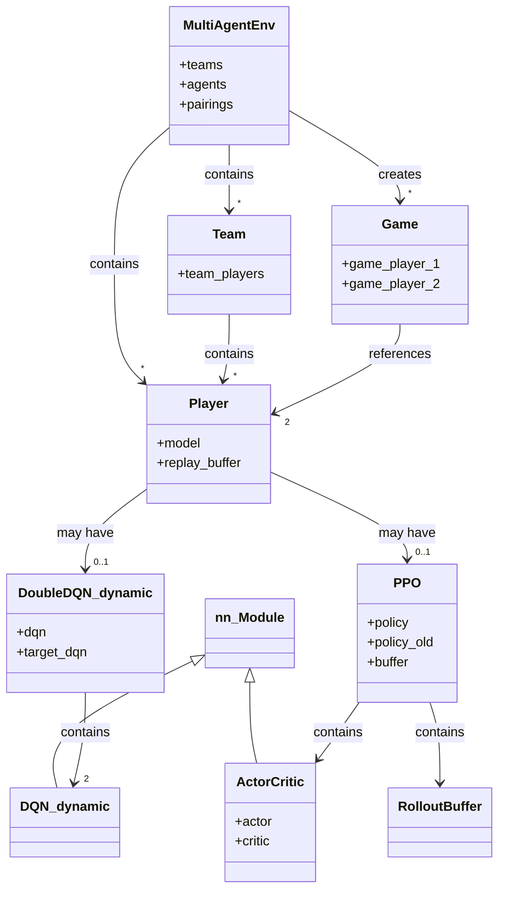
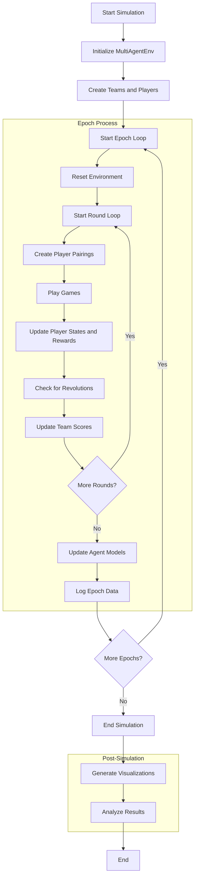

# Revolution

## Architecture

## Process

**Changelog**

**[Version 5.0](https://github.com/social-ai-uoft/revolutions/tree/version_5.0)**
* **Episodic Memory Empowers Agents:**  Agents now retain memories of past interactions, specific to each opponents, enabling them to develop sophisticated and adaptive strategies.
* **Replay Buffer Improvement:**  Agents now retain replay buffer of past interactions specific to each opponents, enabling user to learn state transition to one user, making predicting opponents behavior more explicit. 
* **Richer State Information:** Agents make more informed decisions by considering additional factors such as relative team performance and opponent identities.
* **NPC Opponents:** Test your agents against a variety of non-player characters (NPCs) with predefined behavioral patterns.
* **Battle of the Sexes Integration:**  The reward function now includes internally both the battle of sexes and the prisoners dilemma. 

**[Version 4.0](https://github.com/social-ai-uoft/revolutions/tree/version_4.0)**
* **Reactive Training:** Agents now adapt their strategies dynamically in response to opponents' predefined actions. We have verified that in fact agents with PPO and episodic memory are able to learn
* **Episodic Memory:** Agents now are able to associate opponents with their previous action within a episode, which significantly improve the agent performance
* **Infinite Horizon:** To better mimic the baseline game, a random episodic length has replaced the fixed length from the previous version 
* **Improved Visualization:** Gain deeper insights into agent behavior over time with refined visualization tools. 
* **Enhanced Codebase:**  black formatted the entire codebase

**[Version 3.0](https://github.com/social-ai-uoft/revolutions/pull/32)**

* **Focus on Baseline Paradigms:** Transitioned core game logic to iterated prisoner's dilemma and battle of the sexes to establish a clear baseline for future exploration. 
* **Added PPO model:** Integrated the Proximal Policy Optimization algorithm for greater model flexibility.
* **Deprecated Revolution logic:** Removed the original Revolution game and related functionality.

**[Version 2.0](https://github.com/social-ai-uoft/revolutions/pull/19)**

* **MongoDB Backend:** Introduced MongoDB for logging, enabling efficient data storage and analysis.

**[Version 1.0](https://github.com/social-ai-uoft/revolutions/pull/6)**

* **Initial Implementation:** Implemented the foundation of the Revolution game using OOP and a Double DQN model.
